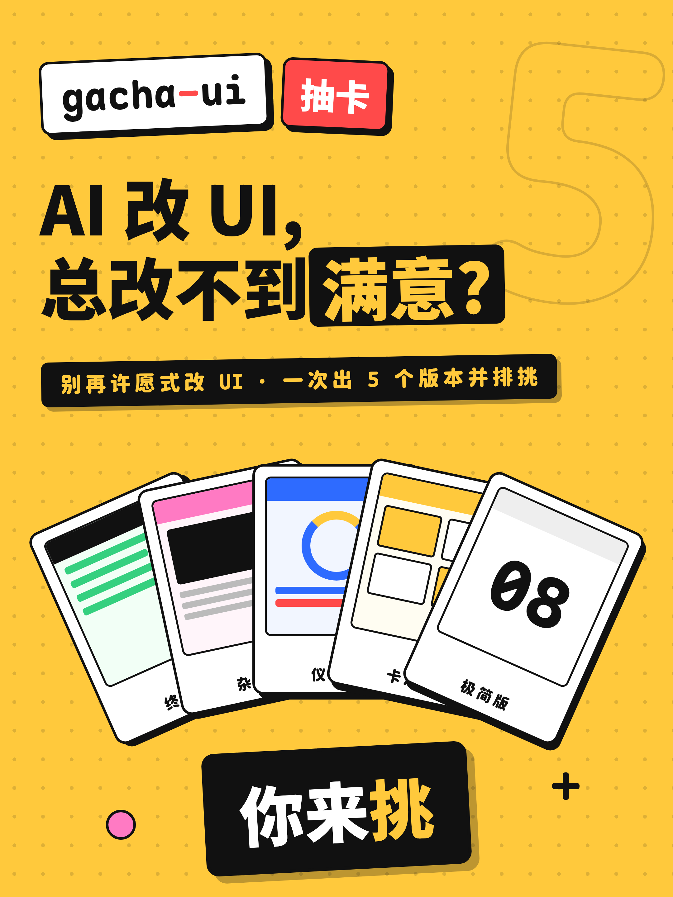
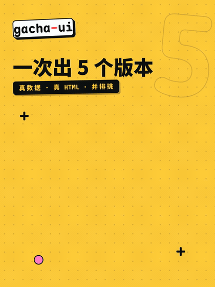

# gacha-ui

**[English](./README.md) · [中文](./README.zh-CN.md)**

[](./SKILL.md)
[](#install)
[](https://github.com/fade2373/gacha-ui/releases)
[](./LICENSE)
[](https://fade2373.github.io/gacha-ui/)

<p align="center">
  
  
</p>

An agent **skill** — works with [Claude Code](https://docs.claude.com/en/docs/claude-code), Codex, OpenClaw, Cursor, or any agent that reads `SKILL.md` — for exploring UI directions the way a designer actually narrows one down: generate several genuinely-different mockups in parallel, look at them **side-by-side**, point at what works, lock it, and narrow — round by round — until it's right. Then build the winner for real.

It turns "make this look better" from *one guess you accept or reject* into *a comparison you steer*.

> The name: each round is a "pull" — you fan out several candidates and pick, like opening cards. The randomness is in the **form**; the **truth** (real data, brand tokens, what you already approved) is locked.

## Promo video

45s intro (Chinese, 3:4 — English version coming):

https://github.com/fade2373/gacha-ui/releases/download/v1.0.0/gacha-ui-promo-cn.mp4

Direct file: [`promo/gacha-ui-promo-cn.mp4`](./promo/gacha-ui-promo-cn.mp4)

## Why this instead of one-shot generation

Asking a model for a single UI gives you its most *typical* answer — the average of its training data, i.e. "AI slop." Asking for one polished draft and iterating it is better, but research on parallel prototyping is blunt about the ceiling: **creating** multiple alternatives only widens *your* exploration — **showing** them side-by-side is what measurably raises the quality of the final pick (Dow & Klemmer 2010; Dow 2011). Comparison lets the human induce *principles* ("the dense one reads faster, the airy one feels premium") instead of reacting to one artifact in isolation, and gives them permission to criticize.

So gacha-ui makes the human the evaluator and the model the generator, in a tight loop. (It's the [parallelization → evaluator-optimizer](https://www.anthropic.com/engineering/building-effective-agents) pattern, with a person in the evaluator seat.) Full evidence: [`reference/why-parallel-prototyping.md`](./reference/why-parallel-prototyping.md).

## The two non-negotiables

1. **Diverge on form, lock the truth.** Every round varies exactly ONE unsettled dimension. Everything already decided — plus real data, brand tokens, and approved elements — is held byte-for-byte identical across all mockups.
2. **The human points; you don't guess.** There's no universal "good-looking" and auto-judges miss brand/aesthetic fit, so the skill always renders and serves the options and the human always makes the real pick. Skipping the show nullifies the method.

## Install

Drop this folder wherever your agent discovers skills:

| Agent | Location |
|---|---|
| Claude Code | `~/.claude/skills/gacha-ui` |
| Codex CLI | `~/.codex/skills/gacha-ui` |
| Other agents | their skills directory — or give the agent `SKILL.md` as context; the method is plain markdown + one Node script |

```bash
# Claude Code example
git clone https://github.com/fade2373/gacha-ui ~/.claude/skills/gacha-ui
```

The screenshot tool needs Playwright + Chromium (optional — if absent, the skill still serves the gallery for you to view and screenshot by hand):

```bash
npm i -D playwright && npx playwright install chromium
```

Agents with skill support auto-discover it. No further config.

## Use

Just describe what you want in natural language — the skill triggers itself when you ask to *compare* UI directions:

- "this section looks cheap / off"
- "make it look better"
- "redesign this card"
- "show me some other directions for the header"
- designing a new surface whose look is unsettled

…or invoke it explicitly: `/gacha-ui <the area>`.

It will **not** trigger for a one-line CSS fix (just do it) or for "write a new page" when you haven't asked to compare options — that's a job for a single high-quality draft, not a gacha.

## How it works (the loop)

```
Gate 0   Should we even gacha? (one-liner → just do it). Pick the target + mode.
  A      Recon: real data, brand tokens, target viewport — locked verbatim.
  B      Diverge: N throwaway HTML mockups, varying ONE axis, forced to be distinct.
  C      Show & select: screenshot + serve side-by-side; you pick / rank / "winner + worst".
  D      Extract: turn your words into locked constraints (I Like / I Wish / What If).
  E      Converge: approved? stalled? capped? → loop B–E on the next axis, or finish.
  F      Land it: build the winner in the real stack with the real data source.
  G      Refine: visual-diff against the approved mockup; fix only what differs.
```

A worked example end-to-end: [`reference/walkthrough.md`](./reference/walkthrough.md).

## Layout

```
SKILL.md                              the playbook the agent reads
reference/walkthrough.md              one concrete round, start to finish
reference/lock-ledger.md              recon/fidelity rules + the lock-ledger + select/converge protocol
reference/diversity-recipe.md         pick the axis, size N, force real divergence
reference/style-vocabulary.md         40+ named design languages as per-card exemplar seeds
reference/why-parallel-prototyping.md the evidence behind the method
scripts/serve-and-shoot.js           screenshot every mockup + serve them in a side-by-side grid
```

### The script

```bash
node scripts/serve-and-shoot.js <dir> [port=auto] [width=1280]
```

Screenshots every `*.html` in `<dir>` (full-page, 2× DPI), writes a dark **grid** gallery so the mockups sit side-by-side, and starts a detached local server on a free port. Degrades gracefully if Playwright is missing.

## Requirements

- An AI coding agent that reads `SKILL.md` skills (Claude Code, Codex, OpenClaw, Cursor, …)
- Node.js (for the screenshot/serve script)
- Playwright + Chromium (optional, for automated screenshots)

## License

[MIT](./LICENSE)
